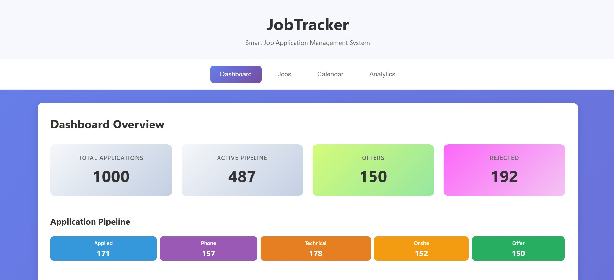

# JobTracker - Smart Job Application Management System

## Author
Sandeep Samuel Jayakumar

## Class Link
CS5010 - Programming Design Paradigms - Northeastern University

## Project Objective
JobTracker is a comprehensive job application management system designed to help job seekers organize and track their job search process. The application centralizes all job applications, tracks interview stages, provides analytics insights, and sends follow-up reminders, turning the chaotic job search process into a data-driven strategy.

## Screenshot


## Features
- **📊 Dashboard Overview**: Real-time statistics of your job search progress
- **💼 Job Application Tracking**: Track applications through multiple stages (Applied, Phone Screen, Technical, Onsite, Offer, Rejected)
- **📅 Interview Calendar**: Visual calendar showing upcoming interviews with detailed prep notes
- **📈 Analytics & Insights**: Data-driven insights including response rates, success rates, and resume performance
- **🔔 Follow-up Reminders**: Automatic alerts for applications needing follow-up after 7 days
- **📝 Detailed Notes**: Store interview questions, feedback, and company-specific notes
- **👥 Contact Management**: Keep track of recruiter and interviewer contact information
- **🎯 Resume Performance Tracking**: Analyze which resume versions get the best response rates

## Technology Stack
- **Frontend**: React 18 with Hooks, PropTypes, CSS3
- **Backend**: Node.js, Express.js
- **Database**: MongoDB (MongoDB Atlas cloud)
- **Deployment**: [Add deployment URL here]

## Instructions to Build

### Prerequisites
- Node.js (v14 or higher)
- npm (v6 or higher)
- MongoDB Atlas account (free tier)
- Git

### Installation Steps

1. **Clone the repository**
```bash
git clone https://github.com/yourusername/job-tracker.git
cd job-tracker
```

2. **Setup Backend**
```bash
# Navigate to server directory
cd server

# Install dependencies
npm install

# Create .env file from example
cp .env.example .env

# Edit .env with your MongoDB connection string
# MONGODB_URI=your_mongodb_connection_string
```

3. **Setup Frontend**
```bash
# Navigate to client directory
cd ../client

# Install dependencies
npm install
```

4. **Seed Database (Optional - adds 1000+ sample records)**
```bash
# From server directory
cd ../server
npm run seed
```

5. **Run the Application**

Start the backend server (Terminal 1):
```bash
cd server
npm run dev
# Server runs on http://localhost:5000
```

Start the frontend (Terminal 2):
```bash
cd client
npm start
# App opens automatically at http://localhost:3000
```

## How to Use

### Getting Started
1. **Dashboard**: View your job search overview with statistics and pipeline visualization
2. **Add Jobs**: Click "Jobs" → "+ Add New Job" to add applications
3. **Track Progress**: Update job status as you progress through interview stages
4. **Follow-ups**: Check dashboard for applications needing follow-up (7+ days old)
5. **Analytics**: View insights about your job search performance

### Key Features Usage

#### Adding a Job Application
1. Click "Jobs" in navigation
2. Click "+ Add New Job" button
3. Fill in company details, position, and contact information
4. Select resume version used
5. Add notes about the company/role
6. Click "Add Job" to save

#### Tracking Interview Progress
1. Find job in the Jobs list
2. Click "Edit" button
3. Update status (Phone Screen → Technical → Onsite → Offer/Rejected)
4. Add interview notes and questions asked
5. Mark "Response Received" when you hear back

#### Using Analytics
- View response rates by resume version
- Track average time to response
- See success/rejection rates
- Identify top companies you've applied to
- Monitor monthly application trends

#### Calendar View
- See all upcoming interviews at a glance
- Different colors for interview types
- Includes interview details and prep notes

## Project Structure
```
job-tracker/
├── client/                 # React frontend
│   ├── public/
│   ├── src/
│   │   ├── components/    # React components (each with .js and .css)
│   │   │   ├── Dashboard/
│   │   │   ├── JobList/
│   │   │   ├── JobForm/
│   │   │   ├── InterviewCalendar/
│   │   │   └── Analytics/
│   │   ├── services/      # API service functions
│   │   ├── App.js         # Main app component
│   │   └── index.js       # Entry point
│   └── package.json
│
├── server/                 # Express backend
│   ├── models/            # MongoDB models (Job, Interview)
│   ├── routes/            # API routes
│   ├── scripts/           # Database seeding script
│   ├── config/            # Database configuration
│   ├── server.js          # Main server file
│   └── package.json
│
├── README.md
└── LICENSE (MIT)
```

## API Endpoints

### Jobs
- `GET /api/jobs` - Get all jobs with optional filters
- `GET /api/jobs/:id` - Get specific job
- `POST /api/jobs` - Create new job
- `PUT /api/jobs/:id` - Update job
- `DELETE /api/jobs/:id` - Delete job
- `GET /api/jobs/stats/overview` - Get statistics
- `GET /api/jobs/followup/needed` - Get jobs needing follow-up

### Interviews
- `GET /api/interviews` - Get all interviews
- `POST /api/interviews` - Create interview
- `PUT /api/interviews/:id` - Update interview
- `DELETE /api/interviews/:id` - Delete interview
- `GET /api/interviews/calendar/upcoming` - Get upcoming interviews

## Deployment

### Frontend Deployment (Vercel/Netlify)
1. Build the production version: `npm run build`
2. Deploy the `build` folder to your hosting service

### Backend Deployment (Render/Railway)
1. Set environment variables on hosting platform
2. Deploy with Node.js buildpack
3. Ensure MongoDB Atlas whitelist includes hosting IP

## Scripts

### Frontend
- `npm start` - Start development server
- `npm run build` - Build for production
- `npm run lint` - Run ESLint
- `npm run format` - Format code with Prettier

### Backend
- `npm start` - Start production server
- `npm run dev` - Start development server with nodemon
- `npm run seed` - Seed database with 1000+ sample records

## Rubric Compliance
- ✅ Design document with personas, user stories, and mockups (80 points)
- ✅ Full CRUD operations on 2 MongoDB collections (15 points)
- ✅ 1000+ synthetic records in database (10 points)
- ✅ 5 React components using hooks, each in own file (15 points)
- ✅ PropTypes defined for all components (5 points)
- ✅ ESLint configuration with no errors (5 points)
- ✅ Prettier formatting applied (5 points)
- ✅ Component-specific CSS organization (5 points)
- ✅ No prohibited libraries (axios, mongoose, CORS) (-20 avoided)
- ✅ Clean, organized code structure (5 points)
- ✅ MIT License included (5 points)

## Demo Video
[Link to demo video - to be added]

## Live Demo
[Deployment URL - to be added]

## License
MIT License - See LICENSE file for details

## Contributing
This is a class project for CS5010. For any questions or suggestions, please contact the author.

## Acknowledgments
- Northeastern University CS5010 Course Staff
- MongoDB Atlas for database hosting
- Create React App for initial setup

---
**© 2025 Job Tracker - Made by Sandeep Samuel Jayakumar**